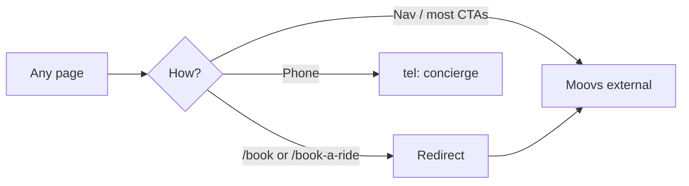

# HiTouch Luxury Charter — User flow & link map

This document is the **story of the product** in the repo: who arrives, what they want, where they go next, and how **marketing**, **Moovs**, **intake APIs**, **staff admin**, and the **corporate client portal** fit together. Technical tables and file pointers follow the same facts as the codebase.

---

## 1. Who arrives, and what “done” looks like

| Persona | Typical goal | Success in this app |
|--------|----------------|----------------------|
| **Leisure / ad-hoc booker** | Reserve a vehicle soon | Reach **Moovs** (external booking) or **call** the concierge. |
| **Company travel buyer** | Open a corporate relationship | Submit **`/corporate`** intake → optionally use **`/portal/corporate`** after staff enables them. |
| **Event planner** | Coordinate transport for an occasion | Submit **`/events`** intake. |
| **Experience-led guest** | Describe a bespoke itinerary | Submit **`/experience-request`** (long form) or fall back to Moovs / contact. |
| **Staff (HiTouch)** | Review and triage inbound interest | Sign in at **`/admin/login`**, work **Corporate / Events / Experience** queues, set lead status, **grant or revoke** corporate portal access. |
| **Onboarded corporate client** | Self-serve shortcuts (Moovs, fleet, contact) | **`/portal/corporate`**: request magic link to the **email that was granted** on their corporate lead. |

There is **no** authenticated end-user “booking history” app in this repo beyond the corporate portal shortcuts. **Moovs** owns the live booking UX.

---

## 2. The story in five beats

1. **Discovery** — Almost every marketing page shares the same shell: nav, footer, floating contact/call (`app/(marketing)/layout.jsx`, `site-nav`, `site-footer`, `floating-comms`). Content and URLs are driven largely by **`content/site.js`**.
2. **Book now** — Most primary CTAs send people to **Moovs** (`site.moovsBookingUrl`), often in a new tab. Short URLs **`/book`** and **`/book-a-ride`** redirect straight to Moovs for bookmarks and deep links.
3. **Tell us more** — Three intake surfaces (**corporate**, **events**, **luxury experience**) validate input, log server-side, and **persist** rows for the staff desk (database or local JSON file — see §8).
4. **Staff follow-up** — After sign-in, staff see counts and lists, mark leads **pending / accepted / declined**, and for **corporate** leads only can **grant** or **revoke** portal access tied to the lead’s email (see §9).
5. **Corporate client return visit** — Enabled clients go to **`/portal/corporate`**, enter that email, open the **one-time magic link** (email via Resend when configured, or **in-page dev link** / server log when email is not sent in development), and land on a small **dashboard** of shortcuts (`content/corporate-portal.js`).

---

## 3. Global shell (every marketing page)

| Element | Where defined | Links / behavior |
|--------|----------------|------------------|
| **Sticky nav** | `app/(marketing)/layout.jsx` → `components/marketing/site-nav.jsx` | Brand → `/`. Nav items from `content/site.js` → `nav`. **Book now** → `site.moovsBookingUrl` (new tab). **Phone** → `tel:` (compact pill with icon). |
| **Footer** | `components/marketing/site-footer.jsx` | Company: About, FAQ, Contact. Services: catalog, experiences, **Reserve online** (external), Fleet, Corporate, **Corporate client portal** (`/portal/corporate`), Events. Connect: phone, email, **Reserve online**. Legal: Privacy, Terms. |
| **Floating comms** | `components/marketing/floating-comms.jsx` | Chat shell (placeholder), **Contact** opens drawer, **Call** / **Private line** → `tel:`. Drawer: phone, email. |

**Single source of truth for URLs:** `content/site.js` (`moovsBookingUrl`, `nav`, `footerCompany`, `footerLegal`, phone, email).

---

## 4. External booking (Moovs)

- **URL:** `https://customer.moovs.app/hitouch-luxury-charter/request/new` (`site.moovsBookingUrl`).
- **Used from:** Nav “Book now”, primary **Reserve online** / booking CTAs across pages, footer, fleet modals, home hero, home reserve strip, `/book` redirect, optional `/book-a-ride` redirect for old bookmarks.

**Story:** the visitor clicks → new tab (where `target="_blank"` is set) or same-tab redirect from `/book` or `/book-a-ride` → **Moovs** runs the rest of the booking experience.

---

## 5. Home page (`/`) internal link flow

```text
/ (home)
├── #experience          ← nav “Experience” (in-page anchor)
├── /services            ← bento: airport, private tours
├── /corporate           ← bento: corporate travel
├── /events              ← bento: weddings & galas
├── /fleet               ← hero “View fleet”; fleet section CTA
├── Partner booking (external) ← hero primary; reserve strip
└── tel:                 ← hero + reserve strip
```

Bento tile links: `content/home.js` → `servicesBento[]` (`href` per tile).

---

## 6. Intake forms → APIs (no Moovs)

These are **on-site forms** that `POST` JSON to Next **Route Handlers**. They **validate**, **log** to the server console (`console.info`), and **persist** corporate, events, and luxury experience payloads (§8).

| Page | Form component | API route |
|------|----------------|-----------|
| `/corporate` | `components/marketing/corporate-account-form.jsx` | `POST /api/corporate` |
| `/events` | `components/marketing/event-coordinator-form.jsx` | `POST /api/events` |
| `/experience-request` | `components/marketing/experience-request-form.jsx` | `POST /api/experience-request` |

**Story:** the visitor completes the form on the same URL → sees success or inline error → the row appears for staff under the matching admin tab. If persistence fails, the API returns **500** and the visitor sees an error message.

---

## 7. Site map (on-site routes)

| Path | Page purpose |
|------|----------------|
| `/` | Home: hero, value props, services bento, fleet showcase, testimonials/metrics, reserve strip (single **Reserve online** CTA + private line). |
| `/services` | Service catalog + cards; B2B band links to `/corporate`, `/events`. |
| `/fleet` | Fleet gallery + cards; CTAs to Moovs + `/services` + `/contact`. |
| `/about` | Firm story; CTAs to Moovs, `/contact`, `/faq`. |
| `/contact` | Contact info; CTAs to reserve online + `/experience-request`. |
| `/faq` | FAQ list; CTAs to Moovs + `/contact`. |
| `/corporate` | B2B copy + **Corporate account form** → `POST /api/corporate`; CTA to **`/portal/corporate`** for clients whose portal access staff has enabled. |
| `/portal/corporate` | **Corporate client portal:** email → magic link → verify → session → dashboard tiles (`content/corporate-portal.js`). Details in §9. |
| `/events` | Events copy + **Event coordinator form** → `POST /api/events`. |
| `/experience-request` | Long intake form → `POST /api/experience-request`; CTAs to reserve online + `/contact`. |
| `/privacy`, `/terms` | Legal text. |
| `/book` | **Server redirect** → `site.moovsBookingUrl` (no UI). |
| `/book-a-ride` | **Server redirect** → `site.moovsBookingUrl` (optional bookmark URL; not linked in marketing UI). |
| `/admin/login` | Staff sign-in for B2B lead desk (not in public nav). |
| `/admin`, `/admin/corporate`, `/admin/events`, `/admin/experience` | Password-protected overview and queues (§8). Corporate queue includes **Grant portal** / **Revoke portal** (§9). |

---

## 8. Staff admin (B2B leads)

| Path | Purpose |
|------|---------|
| `/admin/login` | Staff sign-in: `ADMIN_USERNAME` (defaults to `admin`) + `ADMIN_PASSWORD`, session signed with `ADMIN_SESSION_SECRET`. |
| `/admin` | Overview counts + storage mode hint. |
| `/admin/corporate` | Corporate leads; **Accept** / **Decline** / **Mark pending**; **Grant portal** / **Revoke portal**. |
| `/admin/events` | Event inquiries; same lead-status controls. |
| `/admin/experience` | Luxury experience intakes; same lead-status controls. |

**APIs:** `POST /api/admin/login`, `POST /api/admin/logout`, `POST /api/admin/lead-status` with JSON body `{ id, status, scope }` where **`scope`** is `"corporate"`, `"events"`, or **`"experience"`** (staff session cookie `hitouch_admin_sess`, path **`/`**, so `/api/admin/*` can authenticate).

**Lead status:** Each row is `pending` → `accepted` or `declined`, with optional `reviewed_at` (Neon columns added automatically; file store gets fields on new writes; legacy file rows default to `pending` when read).

**Storage (`lib/lead-storage.js`):**

- If **`DATABASE_URL`** is set (Neon/Postgres): tables `corporate_leads`, `event_leads`, and **`experience_leads`** (full experience body in **`payload` jsonb**; created on first write).
- If unset: **`data/b2b-leads.json`** (gitignored `/data/`) with **`corporate`**, **`events`**, and **`experience`** arrays — fine for **local dev** or a **single** Node host; use the database for multi-instance serverless.

**Env:** `.env.example` (`ADMIN_*`, optional `DATABASE_URL`, portal vars in §9).

---

## 9. Corporate client portal (magic link)

| Path / API | Purpose |
|------------|---------|
| `/portal/corporate` | Email capture or, when signed in, **dashboard** (tiles: Moovs, fleet, experience request, contact, `tel:`, `mailto:`). |
| `POST /api/portal/corporate/request-link` | If email has an **active grant**, creates a one-time token, emails via Resend when configured. If email is not sent (`next dev` without Resend, or send failure) and **dev exposure** is allowed, JSON may include **`devMagicLinkUrl`**; the portal UI shows an **Open magic sign-in link** control. Otherwise the verify URL is logged server-side. Rate-limited. |
| `GET /api/portal/corporate/verify?token=…` | Consumes token, sets `hitouch_corp_sess` cookie (`path: /portal/corporate`), redirects to dashboard. |
| `POST /api/portal/corporate/logout` | Clears portal session cookie. |
| `POST /api/admin/corporate-portal-grant` | Staff only: `{ corporateLeadId }` → grant for that lead’s **intake email**. |
| `POST /api/admin/corporate-portal-revoke` | Staff only: `{ corporateLeadId }` → revoke active grant. |

**Provisioning story:** a lead appears from **`/corporate`** → staff opens **`/admin/corporate`** → **Grant portal** → that lead’s email is allowed to request links. **Revoke** removes that access immediately for future link requests.

**Storage (`lib/corporate-portal-storage.js`):**

- With **`DATABASE_URL`:** `corporate_portal_grants` and `corporate_portal_magic_tokens` (FK to `corporate_leads`).
- Without: **`data/corporate-portal.json`** under `/data/`.

**Env (portal):** `CORPORATE_PORTAL_SESSION_SECRET` (required for verify + sessions), `RESEND_API_KEY` + `CORPORATE_PORTAL_FROM_EMAIL` for email, optional `NEXT_PUBLIC_SITE_URL` for absolute links in mail.

**Client story:** `/portal/corporate` → enter the **granted** email → open magic link within **30 minutes** (single use) → dashboard. Without Resend, **`next dev`** shows the link on the same page; for **`next start`** without email, set **`CORPORATE_PORTAL_DEV_RETURN_LINK=true`** (see `.env.example`). The verify URL is still logged server-side as a fallback.

**Local demo accounts:** run `npm run seed:corporate-demo` to upsert two leads with portal grants: **`demo-alpha@hitouch-portal.test`** (Demo Alpha Logistics) and **`demo-beta@hitouch-portal.test`** (Demo Beta Capital). Uses Postgres when `DATABASE_URL` is set, otherwise `data/b2b-leads.json` + `data/corporate-portal.json`. Re-run safely; it replaces those fixed IDs each time.

---

## 10. Journey diagrams (Mermaid)

### 10.1 “I want to book a ride”



### 10.2 “I’m a company or event planner”

```mermaid
flowchart TD
  H[Home or Services] --> C[/corporate/]
  H --> E[/events/]
  C --> F1[Corporate form]
  E --> F2[Events form]
  F1 --> API1[POST /api/corporate]
  F2 --> API2[POST /api/events]
  API1 --> D[Staff desk /admin/corporate]
  API2 --> DE[/admin/events]
  C --> M[Moovs book travel]
  E --> M
```

### 10.3 “I want the luxury experience questionnaire”

```mermaid
flowchart LR
  N[Nav or Footer] --> X[/experience-request/]
  X --> F[Experience request form]
  F --> API[POST /api/experience-request]
  API --> ADM[/admin/experience]
  X --> M[Reserve online]
```

### 10.4 “Staff triages a lead”

```mermaid
flowchart TD
  L[/admin/login] --> S[Staff session cookie]
  S --> Q{Which queue?}
  Q --> C[/admin/corporate]
  Q --> EV[/admin/events]
  Q --> XP[/admin/experience]
  C --> A[Accept / Decline / Mark pending]
  EV --> A
  XP --> A
  C --> G{Corporate only}
  G -->|Optional| P[Grant or Revoke portal]
```

### 10.5 “Corporate client signs in (after grant)”

```mermaid
flowchart TD
  P[/portal/corporate] --> E[Enter email]
  E --> R[POST request-link]
  R -->|Grant exists| T[Magic token + email or console URL]
  T --> V[GET verify with token]
  V --> D[Dashboard tiles]
  R -->|No grant| Z[Generic success message no leak]
```

---

## 11. Quick reference — “what links where”

| From | To |
|------|-----|
| `site.nav` | `/#experience`, `/services`, `/fleet`, `/experience-request`, `/corporate`, `/events` |
| Nav (extra) | Partner booking (Book now), `tel:` |
| Footer Services | `/services`, `/experience-request`, reserve online (external), `/fleet`, `/corporate`, **`/portal/corporate`**, `/events` |
| Footer Company | `/about`, `/faq`, `/contact` |
| Footer Connect | `tel:`, `mailto:`, reserve online (external) |
| Home bento | `/corporate`, `/events`, `/services` (×2) |
| `/book` | **302/307 redirect** → Moovs |
| `/book-a-ride` | **redirect** → Moovs |

---

## 12. Updating this map later

- **Change Moovs URL or phone:** `content/site.js`.
- **Add/remove nav item:** `content/site.js` → `nav`; if it’s a booking link, also update `site-nav.jsx` if it’s not driven by `nav`.
- **New marketing page:** add `app/(marketing)/…/page.jsx` and link it from `nav`, footer, or home `content/home.js` as needed.
- **Admin / B2B / portal:** `.env.example`; `lib/lead-storage.js`; `lib/corporate-portal-storage.js`; `lib/corporate-portal-auth.js`; `lib/admin-auth.js`.

If you want this exported as **PDF** or a **diagram file** (e.g. for Notion), say what format you prefer.
